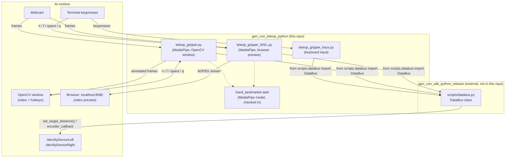

# GenRobot Gripper Teleoperation Tools

A collection of Python tools for teleoperating a GenRobot gripper through the **GenRobot Gripper Controller Python SDK** ([`gen_con_sdk_python_release`](https://github.com/genrobot-ai/gen_con_sdk_python_release)).

This repository includes:

| Script | Input | Preview | Best for |
| --- | --- | --- | --- |
| `teleop_gripper_keys.py` | Keyboard | Terminal UI | No camera needed, good for checking the controller connection |
| `teleop_gripper.py` | Webcam hand tracking | Native OpenCV window | Native Linux with a display |
| `teleop_gripper_WSL.py` | Webcam hand tracking | Browser at `localhost:8080` | WSL2, where a native OpenCV window isn't reliable |
| `teleop_client.py` | n/a | n/a | In-progress client for deeper SDK integration (interface may change) |

The keyboard and hand-tracking scripts support single gripper (`left` / `right`) and dual gripper (`dual`) modes.

> This repository does not include the GenRobot Gripper Controller Python SDK. Clone and configure the SDK separately, see [Setup](#setup) below.

## Project structure

```
gen_con_teleop_python/
├── README.md
├── .gitignore
├── hand_landmarker.task          # MediaPipe hand landmark model (binary, checked in, see Dependencies)
├── teleop_gripper_keys.py        # Keyboard control
├── teleop_gripper.py             # Hand-tracking control, native OpenCV window
├── teleop_gripper_WSL.py         # Hand-tracking control, browser preview for WSL2
├── teleop_client.py              # In-progress SDK client
└── scripts/                      # NOT part of this repo, symlink or copy from the SDK (see Setup)
    ├── __init__.py
    ├── databus.py
    └── ...
```

`scripts/` is deliberately excluded from this repo. It belongs to `gen_con_sdk_python_release` and should be symlinked in, not duplicated, so it always matches the SDK version you actually have installed.

### How the pieces fit together



## Prerequisites

- Python 3.8+
- GenRobot gripper controller (one for single mode, two for dual mode)
- The **GenRobot Gripper Controller Python SDK** (`gen_con_sdk_python_release`), with its `scripts/` folder accessible from wherever you run these tools
- SDK connection settings configured for your controller
- `teleop_gripper.py` and `teleop_gripper_WSL.py` additionally need a webcam
- `teleop_gripper.py` needs a display (it opens a native OpenCV window)
- `teleop_gripper_WSL.py` on WSL2 needs a Chrome/Edge browser on the Windows host to view the stream
- A safe, clear workspace for testing gripper motion

## Setup

1. Clone the SDK separately (not part of this repo):

```
git clone https://github.com/genrobot-ai/gen_con_sdk_python_release.git
```

2. Clone this repo:

```
git clone https://github.com/anthonyshen-GR/gen_con_teleop_python.git
cd gen_con_teleop_python
```

3. Make `scripts/` from the SDK accessible next to these scripts. A symlink is recommended so this repo never drifts from your actual SDK version:

```
ln -s /path/to/gen_con_sdk_python_release/scripts ./scripts
```

4. Create and activate a virtual environment, then install dependencies:

```
python3 -m venv venv
source venv/bin/activate
pip install pyserial opencv-python mediapipe numpy
```

The local `venv/` directory is ignored by Git and should not be committed. If you hit a `PEP 668 externally-managed-environment` error installing without a venv, either use the venv above (recommended) or add `--break-system-packages` to the `pip install` command.

5. Make sure your udev rules are set up so the controller(s) appear as `/dev/ttyDeviceLeft` / `/dev/ttyDeviceRight` (see the SDK's README for USB setup). On WSL2, this also requires `usbipd attach`-ing the device(s). The USB passthrough steps must be redone after every WSL restart or replug.

6. Start with keyboard teleoperation to verify the controller connection, then move to hand tracking. Try a single gripper first, and dual once you're comfortable with the calibration flow.

## `teleop_gripper_keys.py`: Keyboard Control

Direct, predictable manual control. Good for verifying the SDK can connect to the controller, testing basic gripper movement, or demonstrating control without a camera. Keep the terminal window focused while using keyboard controls.

### Modes

Single gripper:

```
python3 teleop_gripper_keys.py left
python3 teleop_gripper_keys.py right --port /dev/ttyUSB0
```

Dual gripper:

```
python3 teleop_gripper_keys.py dual
python3 teleop_gripper_keys.py dual --left-port /dev/ttyUSB0 --right-port /dev/ttyUSB1
```

### Controls

| Key | Single mode | Dual mode |
| --- | --- | --- |
| Right / Up | Open | Open RIGHT gripper |
| Left / Down | Close | Close RIGHT gripper |
| D / W | n/a | Open LEFT gripper |
| A / S | n/a | Close LEFT gripper |
| Space | Stop / hold | Stop / hold both |
| Home | Full open (0.103 m) | Both full open |
| End | Full close (0.000 m) | Both full close |
| R | Re-center to 0.050 m | Both re-center |
| Q | Disable motor and quit | Disable both and quit |

### Options

| Flag | Default | Description |
| --- | --- | --- |
| `--port` | `/dev/ttyDeviceLeft` / `Right` | Serial port override, single mode only |
| `--left-port` | `/dev/ttyDeviceLeft` | Left gripper's serial port, dual mode only |
| `--right-port` | `/dev/ttyDeviceRight` | Right gripper's serial port, dual mode only |
| `--gripper-type` | `default_gripper` | Gripper type passed to the SDK's `DataBus` |
| `--step-rate` | `0.05` | Meters per second of travel while a direction key is held |
| `--start` | `0.05` | Starting target distance, meters |
| `--hz` | `30.0` | Control loop rate |

## `teleop_gripper.py`: Hand-Tracking Control (native window)

Opens an OpenCV window called **DAS Gripper Teleop** with your mirrored webcam feed and the MediaPipe hand skeleton drawn on top. The overlay shows the target distance, encoder reading, calibration status, and whether tracking is LIVE or FROZEN. Hotkeys are read from the OpenCV window, so click it to focus before pressing keys.

This is a standalone script. Do not run it alongside `start_gripper.py` or any other script that opens the same serial port.

### Modes

Single gripper:

```
python3 teleop_gripper.py left
python3 teleop_gripper.py right
```

Dual gripper, your left hand drives the left gripper and your right hand drives the right gripper from one webcam feed:

```
python3 teleop_gripper.py dual
python3 teleop_gripper.py dual --left-port /dev/ttyUSB0 --right-port /dev/ttyUSB1
```

### Calibration

Before a hand can drive a gripper, its pinch (thumb tip to index fingertip) needs a closed and an open reference point:

- `n`: capture the current pinch as the CLOSED reference
- `f`: capture the current pinch as the OPEN reference

Both references are needed before the gripper starts following your hand. Until then the overlay reads `NOT CALIBRATED`.

In dual mode, `n` / `f` only apply to hands that are visible in the current frame. You can pinch both hands and press `n` once, or calibrate one hand at a time (for example, pinch your left hand and press `n` while your right hand types). Calibrating one hand never overwrites the other hand's saved reference with an old reading.

### Controls (OpenCV window must be focused)

| Key | Action |
| --- | --- |
| `n` | Capture current pinch as CLOSED reference |
| `f` | Capture current pinch as OPEN reference |
| `SPACE` | Freeze / unfreeze target(s), ignoring hand tracking while frozen |
| `q` / `ESC` | Disable motor(s) and quit |

### Options

| Flag | Default | Description |
| --- | --- | --- |
| `--port` | `/dev/ttyDeviceLeft` / `Right` | Serial port override, single mode only |
| `--left-port` | `/dev/ttyDeviceLeft` | Left gripper's serial port, dual mode only |
| `--right-port` | `/dev/ttyDeviceRight` | Right gripper's serial port, dual mode only |
| `--gripper-type` | `default_gripper` | Gripper type passed to the SDK's `DataBus` |
| `--webcam-index` | `0` | OpenCV camera index |
| `--smoothing` | `0.4` | Pinch-ratio smoothing factor |
| `--hz` | `30.0` | Control loop rate |
| `--invert-hands` | off | Dual mode only, swap which detected hand drives which gripper |

## `teleop_gripper_WSL.py`: Hand-Tracking Control (browser preview)

Same tracking and calibration as `teleop_gripper.py`, but built for WSL2, where a native OpenCV window usually isn't available. It streams your webcam feed with the hand skeleton overlay to `http://localhost:8080`, viewable in Chrome/Edge on the Windows host. Hotkeys are typed in the **terminal**, not the browser tab, since WSL2 has no reliable way to send browser keypresses back to the process.

### Modes

```
python3 teleop_gripper_WSL.py left
python3 teleop_gripper_WSL.py right
python3 teleop_gripper_WSL.py dual
python3 teleop_gripper_WSL.py dual --left-port /dev/ttyUSB0 --right-port /dev/ttyUSB1
```

### Controls (terminal)

| Key | Action |
| --- | --- |
| `n` | Capture current pinch as CLOSED reference |
| `f` | Capture current pinch as OPEN reference |
| `SPACE` | Freeze / unfreeze target(s) |
| `q` / `ESC` | Disable motor(s) and quit |

### Options

Same as `teleop_gripper.py`, plus:

| Flag | Default | Description |
| --- | --- | --- |
| `--http-port` | `8080` | Local port the video stream is served on |

## `teleop_client.py`: SDK client (in progress)

An in-progress client intended to provide deeper integration with the GenRobot Gripper Controller Python SDK. It is meant as a foundation for a more complete controller client. Its interface and supported features may change.

## What the options do

### How hand tracking turns into a gripper position

Every frame, MediaPipe finds 21 landmarks on your hand. The script takes the distance between your thumb tip and index fingertip (the pinch) and divides it by the distance from your wrist to the base of your middle finger. Dividing by hand size means the reading stays about the same whether your hand is close to the camera or far from it.

That ratio is smoothed (see `--smoothing`), then mapped linearly between your two calibration points: the CLOSED reference maps to `0.0 m` and the OPEN reference maps to `0.103 m`. Anything outside your calibrated range is clamped, so the target never leaves `[0.0, 0.103]`.

### `--smoothing` (hand-tracking scripts, default `0.4`)

Controls how much the gripper ignores frame-to-frame jitter in the tracked pinch. Each frame the script computes:

```
smoothed = smoothing * previous_smoothed + (1 - smoothing) * new_reading
```

- `0.0`: no smoothing. The gripper follows the raw reading, which is the most responsive but also the jumpiest
- `0.4` (default): light smoothing, a good balance for most setups
- `0.6` to `0.8`: much smoother motion, but the gripper visibly lags behind your hand
- `1.0`: never updates, the gripper will not respond. Keep it below 1

If the gripper looks twitchy, raise it a little. If it feels sluggish, lower it. Since smoothing runs once per camera frame, the lag you feel also depends on your webcam's frame rate.

### `--step-rate` (keyboard script only, default `0.05`)

How fast the target moves, in meters per second, while you hold a direction key. At `0.05` the gripper sweeps the full `0.103 m` range in about 2 seconds. Raise it for faster travel, lower it for fine adjustments. It has no effect in the hand-tracking scripts, since your hand sets the target directly.

### `--start` (keyboard script only, default `0.05`)

The target distance in meters the gripper is commanded to as soon as the script starts. It is clamped to `[0.0, 0.103]`. The hand-tracking scripts always start at `0.05` and then hold there until calibration is complete.

### `--hz` (all scripts, default `30.0`)

How many times per second the script sends `set_target_distance()` to the controller. 30 matches the encoder feedback rate (fixed at 30 Hz in the scripts). Going much higher doesn't buy smoother motion, and going much lower makes the gripper feel steppy.

### `--gripper-type` (default `default_gripper`)

The gripper type passed straight through to the SDK's `DataBus`. Leave it at the default unless the SDK documents another type for your hardware.

### `--webcam-index` (hand-tracking scripts, default `0`)

Which camera OpenCV opens. `0` is usually `/dev/video0`. If you have a built-in webcam plus an external one, try `1` or `2` to pick the other. The script requests 640x480 MJPG to keep latency low.

### `--invert-hands` (dual mode, hand-tracking scripts)

The video is mirrored before detection, so MediaPipe's Left / Right label should match your own left and right hand. If your setup ends up swapped (your left hand moves the right gripper), add this flag to flip the assignment instead of rewiring anything.

### `--port`, `--left-port`, `--right-port`

Override the default serial ports (`/dev/ttyDeviceLeft`, `/dev/ttyDeviceRight`). Use `--port` with `left` or `right`, and `--left-port` / `--right-port` with `dual`. Handy when udev rules aren't set up and the controllers show up as `/dev/ttyUSB0`, `/dev/ttyUSB1`.

### `--http-port` (WSL script only, default `8080`)

The local port the video stream is served on. Change it if something else on your machine already uses 8080.

## Dependencies

```
pyserial>=3.5
opencv-python>=4.5.0
mediapipe>=0.10.0
numpy>=1.19.0
```

`hand_landmarker.task` (MediaPipe's hand landmark model, used by both hand-tracking scripts) is checked into this repo rather than downloaded at runtime. It's a binary file of about 7 to 8 MB, so the tools work offline on isolated robot networks. The model is published by Google MediaPipe under the Apache 2.0 license.

To verify the file hasn't been altered, compare its checksum:

```
sha256sum hand_landmarker.task
```

If you'd rather not keep binaries in git history, remove the file and download it once instead:

```
wget -O hand_landmarker.task https://storage.googleapis.com/mediapipe-models/hand_landmarker/hand_landmarker/float16/1/hand_landmarker.task
```

## Distance range and port naming: how this differs from the finger tools

If you're also using the finger controller tools ([`gen_finger_con_teleop_python`](https://github.com/anthonyshen-GR/gen_finger_con_teleop_python)), a few constants are different:

- **Valid distance range is `[0.0, 0.103]` meters** (about 10 cm), not the finger's `0.0` to `0.2`
- **Serial ports are `/dev/ttyDeviceLeft` / `/dev/ttyDeviceRight`**, not `/dev/ttyFingerLeft` / `/dev/ttyFingerRight`
- The gripper SDK's `DataBus` takes a **`gripper_type` parameter**, which the finger SDK doesn't have

## Safety

- The teleop scripts are standalone. Do not run them alongside `start_gripper.py` or any other process holding the same serial port. Two processes on one port will corrupt the protocol stream.
- This applies per port in dual mode: make sure nothing else is touching either the left or right serial port before starting.
- Keep the gripper workspace clear before connecting. The target distance defaults to 0.05 m on startup and the gripper moves immediately once the control loop begins.
- With hand tracking, the gripper follows your hand as soon as both calibration points are set. Keep `SPACE` (freeze) and `q` within reach when you first try it, and calibrate with the gripper clear of obstacles.
- Before running hand tracking, make sure the camera is available and the lighting is good enough for reliable detection.